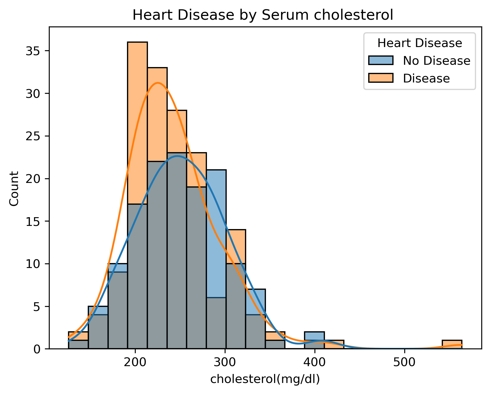

# Heart Disease EDA

### An exploratory data analysis project focused on understanding patterns and relationships in a heart disease dataset.



> Why I built this?

> I built this project to practice how I approach a dataset before jumping into machine learning.
> Instead of immediately training a model, I wanted to first understand the data, investigate its quality, explore relationships between features, and document the patterns I found.

## About the Project

This project is an Exploratory Data Analysis (EDA) of a heart disease dataset.

The main goal of this project is to understand the structure of the dataset and explore patterns and relationships between different features and the presence of heart disease.

The analysis focuses on both individual features and combinations of multiple features to get a better understanding of the data.

> Note: This project is an exploratory analysis and should not be considered a medical diagnostic tool. The observed relationships do not necessarily represent causal relationships.

---

## Objectives

The main questions I tried to explore in this project were:

- What does the dataset look like?
- What types of variables does it contain?
- Are there missing or duplicated records?
- How are the main features distributed?
- How do individual features relate to heart disease?
- Do combinations of features reveal additional patterns?

---

## Dataset

The dataset contains information about individuals and several features related to their physical and cardiac condition.

Some of the main features explored in this project are:

| Feature | Type | Description |
|---|---|---|
| `age` | Numerical | Age of the individual |
| `sex` | Categorical | Sex of the individual |
| `cp` | Categorical | Chest pain type |
| `trestbps` | Numerical | Resting blood pressure |
| `chol` | Numerical | Serum cholesterol |
| `exang` | Categorical | Exercise-induced angina |
| `target` | Categorical | Heart disease status |

Some categorical variables are stored as numerical codes in the original dataset. For example, `cp` is treated as a categorical variable during the analysis.

---

## Data Understanding & Cleaning

Before starting the EDA, I checked the structure and quality of the dataset.

### Missing Values

No missing values were found in the dataset, so no missing-value imputation was required.

### Duplicate Records

One of the first important findings during data cleaning was the unusually high number of duplicate records.

The dataset changed from:

1025 original records → 723 duplicates identified → 302 unique records remaining

This was not treated as a minor cleaning step. Removing such a large portion of the original records can affect the distribution of the data and, consequently, the patterns observed during EDA.

For this reason, the duplicate records became an important limitation to keep in mind when interpreting the results.

---

## Exploratory Data Analysis

The analysis was divided into three main parts.

### 1. Univariate Analysis

First, individual variables were examined to understand their distributions.

The analysis included features such as:

- Age
- Sex
- Chest pain type
- Resting blood pressure
- Cholesterol
- Exercise-induced angina
- Heart disease status

Different visualizations were used depending on the type of variable.

---

### 2. Bivariate Analysis

Next, relationships between individual features and the target variable were explored.

Some of the analyses included:

- Age vs. heart disease
- Sex vs. heart disease
- Chest pain type vs. heart disease
- Resting blood pressure vs. heart disease
- Cholesterol vs. heart disease
- Exercise-induced angina vs. heart disease

The purpose was not to prove causation, but to identify patterns that could be worth investigating further.

---

### 3. Multivariate Analysis

Finally, multiple features were analyzed together.

Examples include:

- Age + Sex + Chest Pain Type
- Age + Chest Pain Type + Exercise-Induced Angina
- Sex + Chest Pain Type + Exercise-Induced Angina
- Age + Resting Blood Pressure + Cholesterol

This part of the analysis helped show that heart disease status cannot be explained well by looking at only one feature.

---

## Visualizations

The project uses several types of visualizations, including:

- Count plots
- Bar plots
- Histograms
- Box plots
- Scatter plots
- Heatmaps

The generated figures are stored in the `figures/` directory.

---

## Key Findings

After exploring the dataset from individual features to multiple-feature combinations, several patterns stood out:

- Age showed different patterns between individuals with and without heart disease.
- Chest pain type showed noticeable differences between the two target groups.
- Exercise-induced angina also showed different patterns depending on heart disease status.
- Cholesterol showed a more noticeable pattern with heart disease in this dataset than resting blood pressure.
- Looking at multiple features together provided more information than looking at individual features separately.
- Some small subgroups showed very high observed disease rates, but these groups contained limited numbers of observations and should therefore be interpreted carefully.

These findings describe patterns observed in this dataset and should not be generalized directly to the wider population.

---

## Project Structure

```text
heart-disease-eda/
│
├── data/
│   └── README.md
│
├── notebooks/
│   └── heart_disease_eda.ipynb
│
├── figures/
│   ├── ...
│   └── ...
│
├── reports/
│   └── heart_disease_eda_report.pdf
│
├── README.md
├── requirements.txt
└── .gitignore
```

### Folder Description

- `data/` — Information and documentation related to the dataset
- `notebooks/` — Jupyter Notebook containing the analysis
- `figures/` — Visualizations generated during the analysis
- `reports/` — Detailed project report
- `requirements.txt` — Python dependencies
- `.gitignore` — Files and folders excluded from Git

---

## Tools & Technologies

- Python
- Pandas
- Matplotlib
- Seaborn
- Jupyter Notebook

---

## How to Run

### 1. Read the dataset documentation

Before downloading or using the dataset, read the documentation provided in:

```text
data/README.md
```

It contains the information you need about the dataset and how it should be used in this project.

### 2. Download the dataset

After reading `data/README.md`, download the dataset by following the instructions provided there.

Place the downloaded dataset in the appropriate location inside the `data/` directory.

### 3. Install the required dependencies

Clone the repository and install the required Python packages:

```bash
pip install -r requirements.txt
```

### 4. Run the analysis

Open the Jupyter Notebook:

```text
notebooks/heart_disease_eda.ipynb
```

Then run the cells to reproduce the analysis and generate the visualizations.

---

## Limitations

There are several limitations to this analysis:

- The dataset may not be representative of the entire population.
- A large number of duplicated records were removed, which may have affected the data distribution.
- Some combinations of features resulted in small subgroups, making their observed patterns less reliable.
- Some categorical variables are represented using numerical codes.
- The analysis shows associations and patterns, not causal relationships.
- The results should not be used for medical decision-making.
- Statistical analysis and machine learning models would be needed for a deeper evaluation of the observed patterns.

---

## Future Improvements

Possible next steps for this project include:

- Applying statistical tests to evaluate the observed relationships.
- Performing more detailed feature analysis.
- Exploring feature importance.
- Building machine learning models.
- Comparing different classification models.
- Evaluating model performance using appropriate metrics.

---

## Report

A more detailed analysis of the project is available in:

```text
reports/heart_disease_eda_report.pdf
```

The report (in Persian) includes the data understanding process, exploratory analysis, visualizations, findings, limitations, and conclusion.

---

## What I Learned

Through this project, I practiced:

- Understanding a real-world dataset before analyzing it
- Identifying different types of variables
- Handling duplicated records
- Working with categorical variables represented as numerical codes
- Performing univariate, bivariate, and multivariate EDA
- Choosing visualizations based on the type of analysis
- Interpreting patterns without treating them as causal relationships
- Organizing an analysis project for GitHub

---

## Conclusion

This project was an opportunity to practice Exploratory Data Analysis on a heart disease dataset.

The analysis showed different patterns between heart disease status and features such as age, chest pain, cholesterol, and exercise-induced angina. It also showed that combining multiple features can provide a better view of the structure of the data.

This project is mainly an EDA and can be used as a starting point for more detailed statistical analysis and machine learning in future work.

---

### [If you want, you can follow us on Telegram :)](https://t.me/reazion)
Build. Learn. Reazion.
